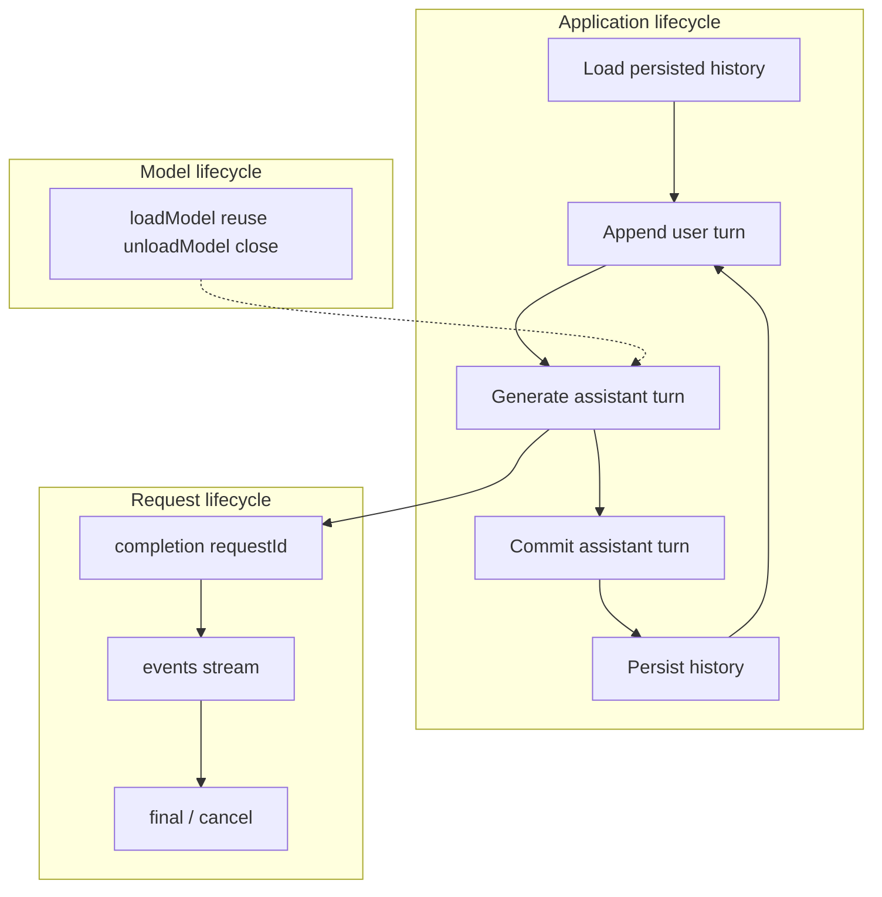

# Clase 4 — Build the Offline Chat

> **The Local-First AI Systems Masterclass** · Módulo 1 — Your First Local Token
> **Baseline técnico:** QVAC SDK v0.18.x / v0.18.1, verificado contra la documentación oficial y npm el 2026-08-26.

---

## Introducción

Un script que llama `completion()` una vez no es un chat. Una aplicación de conversación local requiere historial multi-turno, streaming con frontera de commit, cancelación, persistencia y recuperación tras reinicio.

QVAC provee primitivas de inferencia y runtime. **Tu aplicación posee el estado del producto y la política de persistencia.**

---

## Qué aprenderás

Al terminar esta lección podrás:

1. **Distinguir** estado de aplicación de estado de inferencia/runtime.
2. **Representar** conversación multi-turno como historial ordenado pasado en cada `completion()`.
3. **Construir** un bucle de chat event-driven con `events` + `final`.
4. **Commitear** la salida del asistente solo tras un estado terminal válido.
5. **Cancelar** una completion en vuelo con `cancel({ requestId })`.
6. **Persistir** y **restaurar** historial comprometido en almacenamiento local.
7. **Reutilizar** un modelo cargado entre turnos y cerrar recursos con `unloadModel` / `close`.
8. **Verificar** el chat en modo avión tras restart (modelo ya provisionado).
9. **Medir** TTFT, duración, tok/s y `stopReason` por turno en tu máquina.
10. **Diagnosticar** fallos de consistencia entre output provisional y estado durable.

---

## Definición y contexto

La Clase 3 observó el motor de inferencia: tokens, streaming, `stopReason`. Esta clase construye la **aplicación alrededor del motor**.

Lo que falta en un demo de completion no es "más prompts". Falta arquitectura de aplicación:

```text
model lifecycle
+
conversation state
+
request lifecycle
+
persistence
+
errors
+
user cancellation
+
metrics
+
shutdown
```

| Application state | Model / runtime state |
|---|---|
| conversation history | loaded weights |
| conversation id | runtime/backend |
| UI state | KV cache |
| persistence path | in-flight inference |
| active request id | |
| per-turn metrics | |

**Regla:** Si borras el transcript pero mantienes el modelo, pierdes la conversación pero puedes inferir. Si borras el modelo pero mantienes el transcript, tienes texto pero no puedes generar hasta volver a cargar o provisionar.

---

## Términos

### Índice rápido

| Término | Definición breve | ¿Responsabilidad de la app? |
|---|---|---|
| **Application state** | Historial, IDs, UI y métricas del producto | Sí |
| **Conversation history** | Mensajes `{ role, content }[]` pasados en cada request | Sí |
| **Commit boundary** | Línea entre output provisional y turno durable | Sí |
| **Streaming UX** | Render incremental sin commitear hasta `final` | Sí |
| **Cancellation** | Detener un request activo por `requestId` | Sí (política) |
| **Persistence** | Guardar transcript comprometido en disco local | Sí |
| **Three lifecycles** | Modelo, request y conversación como ciclos independientes | Sí (orquestación) |

### Application state

**Definición:** Datos que la aplicación posee y controla: historial comprometido, IDs de conversación, estado de UI, ruta de persistencia, request activo y métricas por turno.

**Uso:** Separar lo que es producto de lo que es runtime. QVAC no almacena tu chat ni decide cuándo persistir.

**Nota:** KV cache es estado de runtime, no memoria conversacional del producto. Borrar caché del modelo no restaura ni borra el transcript.

### Conversation history

**Definición:** Secuencia ordenada de mensajes `{ role, content }` que la app pasa en el parámetro `history` de cada `completion()`.

**Uso:** Multi-turn behavior. El modelo no recuerda automáticamente entre llamadas aisladas.

**Ejemplo:**

```ts
history: [
  { role: "user", content: "My favorite color for this test is orange." },
  { role: "assistant", content: "Got it — orange for this test." },
  { role: "user", content: "What color did I tell you?" },
]
```

**Resultado:** El segundo turno puede responder usando contexto del primero porque la app incluyó ambos mensajes.

**Nota:** Esto es estado de aplicación, no memoria a largo plazo del modelo.

### Commit boundary

**Definición:** Regla que separa **output provisional del asistente** (stream en pantalla) de **turno comprometido** (parte del historial durable).

**Uso:** Evitar persistir texto incompleto o cancelado como mensaje completo del asistente.

**Política mínima:**

| stopReason | ¿Commitear? |
|---|---|
| `eos` | Sí |
| `length` | Sí (parcial pero terminal) |
| `stopSequence` | Sí |
| `cancelled` | No (o según política documentada) |
| error mid-stream | No |

**Resultado:** Tras cancelación, el historial comprometido no incluye el turno parcial del asistente.

**Nota:** Debes decidir y documentar la política antes de implementar. No hay respuesta universal.

### Streaming UX

**Definición:** Patrón donde `contentDelta` actualiza un buffer provisional en pantalla mientras la generación continúa.

**Uso:** Mostrar progreso al usuario sin tratar el stream como estado durable.

**Flujo recomendado:**

```text
buffer provisional (pantalla)
        ≠
committed history (durable)
```

**Ejemplo:**

```ts
let provisional = "";
for await (const event of run.events) {
  if (event.type === "contentDelta") {
    provisional += event.delta;
    process.stdout.write(event.delta);
  }
}
const final = await run.final;
// Commit solo aquí, con política según final.stopReason
```

**Resultado:** El usuario ve texto crecer en tiempo real. El historial solo cambia tras `final` y la política de commit.

**Nota:** Renderizar output parcial y commitear un turno son operaciones separadas.

### Cancellation

**Definición:** Detener una completion en vuelo usando el `requestId` del `CompletionRun` activo.

**Uso:** Comando `/cancel` o acción equivalente del producto. Acción normal, no error inesperado.

**Sintaxis / API:**

```ts
import { cancel } from "@qvac/sdk";

await cancel({ requestId: activeRun.requestId });
```

**Resultado:** El stream termina con `stopReason: "cancelled"`. El output parcial no debe commitearse por defecto.

**Nota:** Distingue cancelación de usuario, error de runtime, parada por `length` y fin natural (`eos`). No etiquetes todos los errores como "cancelled".

### Persistence

**Definición:** Almacenamiento local del historial comprometido en un schema explícito de la aplicación.

**Uso:** Restaurar conversación tras reinicio del proceso. QVAC no provee chat database ni autosave.

**Schema mínimo:**

```json
{
  "version": 1,
  "conversationId": "uuid",
  "createdAt": "2026-08-26T...",
  "updatedAt": "2026-08-26T...",
  "messages": [
    { "role": "user", "content": "..." },
    { "role": "assistant", "content": "..." }
  ]
}
```

**Prácticas:**

- validar schema al cargar;
- escribir de forma atómica (archivo temporal + rename);
- manejar corrupción con mensaje claro al usuario.

**Resultado:** Tras restart, `load()` restaura mensajes comprometidos. Pesos del modelo y transcript son activos separados.

**Nota:** No mezcles transcript, logs técnicos y caché del modelo. Tienen retenciones distintas.

### Three lifecycles

**Definición:** Tres ciclos de vida independientes que la app debe orquestar: modelo, request y conversación.

**Uso:** Evitar confundir recargar modelo con restaurar chat, o persistir durante el stream.

**1. Model lifecycle:**

```text
find → download → validate → loadModel → reuse → unloadModel → close
```

**2. Request lifecycle:**

```text
completion() → events stream → final → (cancel?) → terminal state
```

**3. Conversation lifecycle:**

```text
load history → append user turn → generate → commit assistant turn → persist → repeat
```



**Resultado:** Cada turno del usuario dispara un request con su propio `requestId`. La conversación sobrevive requests individuales.

**Nota:** KV cache puede acelerar follow-ups cuando el runtime lo soporta (Clase 3). No es requisito para v1 ni sustituto de persistencia.

---

## Referencia QVAC

Funciones documentadas en v0.18.x para esta clase.

### `loadModel()`

**Definición:** Carga un modelo desde caché o fuente remota hacia memoria.

**Uso:** Obtener un `modelId` reutilizable entre turnos. Cargar una vez por sesión, no por mensaje.

| Parámetro | Tipo | Descripción |
|---|---|---|
| `modelSrc` | `CatalogConstant \| string` | Origen del modelo |
| `modelConfig` | `{ ctx_size?: number, ... }` | Configuración del runtime |

**Ejemplo:**

```ts
const modelId = await loadModel({
  modelSrc: LLAMA_3_2_1B_INST_Q4_0,
  modelConfig: { ctx_size: 2048 },
});
```

**Resultado:** `modelId` string válido para múltiples llamadas a `completion()`.

**Nota:** Tras restart offline, `loadModel()` usa caché local si el modelo ya fue provisionado (Clase 1).

### `completion()`

**Definición:** Ejecuta inferencia sobre un modelo cargado. En v0.18.x devuelve un `CompletionRun`.

**Uso:** Un turno de chat con historial explícito y streaming.

| Campo / parámetro | Tipo | Descripción |
|---|---|---|
| `modelId` | `string` | Modelo cargado |
| `history` | `{ role, content }[]` | Historial comprometido + turno actual del usuario |
| `stream` | `boolean` | Si `true`, emite eventos incrementales |
| `run.requestId` | `string` | ID para `cancel()` |
| `run.events` | `AsyncIterable` | Stream con `contentDelta`, etc. |
| `run.final` | `Promise` | Texto agregado, stats, `stopReason` |

**Ejemplo:**

```ts
const run = completion({
  modelId,
  history,
  stream: true,
  generationParams: { temp: 0.7, predict: 256 },
});

let provisional = "";
for await (const event of run.events) {
  if (event.type === "contentDelta") {
    provisional += event.delta;
    process.stdout.write(event.delta);
  }
}

const final = await run.final;
if (final.stopReason !== "cancelled") {
  history.push({ role: "assistant", content: final.contentText });
}
```

**Resultado:** Eventos incrementales durante generación; `final` entrega estado terminal para decidir commit.

**Nota:** Preferir `events` + `final` sobre superficies legacy.

### `cancel()`

**Definición:** Cancela una operación en vuelo identificada por `requestId`.

**Uso:** Comando `/cancel` mientras un turno se está generando.

| Parámetro | Tipo | Descripción |
|---|---|---|
| `requestId` | `string` | ID del `CompletionRun` activo |

**Ejemplo:**

```ts
import { cancel } from "@qvac/sdk";

console.log("requestId:", run.requestId);
await cancel({ requestId: run.requestId });
const final = await run.final;
console.log("stopReason:", final.stopReason); // "cancelled"
```

**Resultado:** El stream termina. La app no debe commitear output parcial salvo política explícita.

**Nota:** `requestId` está disponible sincrónicamente al crear el run.

### `unloadModel()` y `close()`

**Definición:** `unloadModel()` libera el modelo de memoria. `close()` cierra la infraestructura del SDK.

**Uso:** Graceful shutdown tras cancelar requests activos y persistir estado confirmado.

| Parámetro | Tipo | Descripción |
|---|---|---|
| `modelId` | `string` | Modelo a descargar |
| `clearStorage` | `boolean` | Si `true`, borra estado asociado |

**Ejemplo:**

```ts
// Secuencia controlada
if (activeRun) await cancel({ requestId: activeRun.requestId });
await saveHistory(committedHistory);
await unloadModel({ modelId, clearStorage: false });
void close();
```

**Resultado:** Memoria liberada. En Node/Electron, descargar el último modelo puede cerrar la conexión RPC automáticamente.

**Nota:** En Bare el comportamiento puede diferir. Verifica en tu runtime — no asumas simetría.

---

## Ejemplo completo

Flujo incremental en capas (ver `examples/01–06`):

1. Single completion (`01-single-turn.ts`)
2. Multi-turn con history explícita (`02-multi-turn.ts`)
3. Streaming render (`03-streaming.ts`)
4. Cancel mid-stream (`04-cancellation.ts`)
5. Persist JSON (`05-persistence.ts`)
6. Restart offline (`06-restart-offline.ts`)

Esqueleto integrado de un turno con commit boundary:

```ts
import {
  cancel, close, completion, loadModel,
  LLAMA_3_2_1B_INST_Q4_0, unloadModel,
  type HistoryMessage,
} from "@qvac/sdk";

const modelId = await loadModel({
  modelSrc: LLAMA_3_2_1B_INST_Q4_0,
  modelConfig: { ctx_size: 2048 },
});

let history: HistoryMessage[] = [
  { role: "user", content: "Resume en una frase qué es un commit boundary." },
];

const run = completion({ modelId, history, stream: true });

for await (const ev of run.events) {
  if (ev.type === "contentDelta") process.stdout.write(ev.delta);
}

const final = await run.final;
if (["eos", "length", "stopSequence"].includes(final.stopReason)) {
  history.push({ role: "assistant", content: final.contentText });
}

await unloadModel({ modelId, clearStorage: false });
void close();
```

Ejemplos ejecutables en [`examples/`](examples/). Arquitectura modular de referencia en [`app/src/`](app/src/).

---

## Antes de ejecutar

Escribe tus respuestas antes del lab:

1. Si cancelas tras 40 caracteres streamados, ¿deben persistirse como turno completo del asistente?
2. ¿El modelo "recuerda" el chat sin que la app pase `history`?
3. Tras restart sin red, ¿qué falla primero: modelo o transcript?
4. ¿Streaming implica que el output ya es estado durable?
5. ¿Cancelación y error inesperado deben tratarse igual en la UI?

---

## Práctica guiada

Construye **Offline Chat v1** siguiendo el [lab](lab/README.md):

**Parte 1 — Ejemplos incrementales**

Corre en orden `examples/01` a `06`.

**Parte 2 — CLI modular**

Completa los TODO en `app/src/`:

```text
index.ts       — startup, chat loop, /exit /cancel /new
chat.ts        — orquestación de turno (events/final + commit)
history.ts     — tipos y helpers de historial comprometido
persistence.ts — load/save JSON local
metrics.ts     — TTFT, duración, stats por turno
shutdown.ts    — señales, cancelación activa, unload/close
```

**Parte 3 — Acceptance tests A–G**

- multi-turn state
- streaming
- cancellation
- persistence
- offline restart
- metrics
- clean shutdown

**Parte 4 — Break It**

Variante defectuosa: persistir output parcial **durante** el stream, cancelar a mitad, restart, inspeccionar transcript. Diagnóstico esperado: confundió provisional con committed. Fix: commit boundary explícita.

**Parte 5 — Airplane Mode**

1. Provisiona modelo con red.
2. Cierra app con transcript guardado.
3. Desactiva red.
4. Restart → restore → nueva completion.

Entregable: CLI que pasa tests A–G con evidencia documentada.

---

## Errores comunes

| Síntoma | Causa probable | Corrección |
|---|---|---|
| Modelo no recuerda turnos previos | No se pasa `history` en cada `completion()` | Mantener historial comprometido en memoria y pasarlo completo |
| Texto parcial tras restart | Persistir durante el stream | Commitear solo tras `final` y política de éxito |
| Cancelación tratada como error | Captura genérica de excepciones | Distinguir `stopReason: "cancelled"` de fallos de runtime |
| Transcript corrupto tras crash | Escritura no atómica | write temp + rename; validar schema al cargar |
| Modelo se recarga cada turno | `loadModel()` por mensaje | Cargar una vez, reutilizar `modelId` |
| Falla offline tras restart | Modelo no provisionado | Provisionar con red primero (Clase 1) |
| Unload y close idénticos en todo runtime | Asumir comportamiento Node en Bare | Verificar docs del runtime concreto |

### Notas adicionales

1. **"El modelo recuerda el chat automáticamente."** No; la app debe pasar history.
2. **"Streaming output ya es estado durable."** No; es provisional hasta commit.
3. **"Offline significa que nunca necesité provisionar."** Falso; solo reutilizas lo ya local.
4. **"KV cache es memoria conversacional."** No; es optimización de runtime.

---

## Medición

Por cada turno completado, registra lo que la API expone:

| Métrica | Cómo obtenerla | Unidad | Interpretación |
|---|---|---|---|
| TTFT | Primer `contentDelta` − envío del prompt (`performance.now()`) | ms | Latencia percibida hasta primer carácter |
| Duración total | `final` resuelto − inicio del request | ms | Tiempo completo del turno |
| Tokens/segundo | `final.stats.tokensPerSecond` | tok/s | Throughput de decode en ese turno |
| stopReason | `final.stopReason` | enum | Por qué terminó (eos, length, cancelled, …) |

Compara turno normal vs turno cancelado. Estas métricas describen **ese turno en tu máquina**, no rendimiento universal de QVAC.

Evento estructurado recomendado por turno:

```text
turnId, modelId, startedAt, firstDeltaAt, endedAt,
stopReason, tokensObserved, committed, persistenceVersion
```

Conserva evidencia sin capturar contenido sensible por defecto.

---

## Resumen

- Un chat confiable es una máquina de estados alrededor de inferencia, no un loop alrededor de una función prompt.
- Tres ciclos independientes: modelo, request y conversación.
- El historial multi-turno es estado de aplicación; pásalo en cada `completion()`.
- Streaming actualiza buffer provisional; commit ocurre tras `final` según política.
- Cancelación usa `requestId`; no commitees output parcial por defecto.
- Persistencia local es responsabilidad de la app; modelo y transcript son activos separados.
- Métricas por turno dependen del hardware; mídelas en tu equipo.

**Siguiente clase:** embeddings como representación de significado externo (Clase 5). RAG añade conocimiento privado a esta arquitectura (Clase 6).

---

## Fuentes

- QVAC — Text generation: https://docs.qvac.tether.io/ai-capabilities/text-generation/
- QVAC — API Summary v0.18.x: https://docs.qvac.tether.io/reference/api/
- QVAC — How it works: https://docs.qvac.tether.io/about/how-it-works/
- QVAC — Release notes: https://docs.qvac.tether.io/reference/release-notes/
- npm @qvac/sdk 0.18.1: https://www.npmjs.com/package/@qvac/sdk
