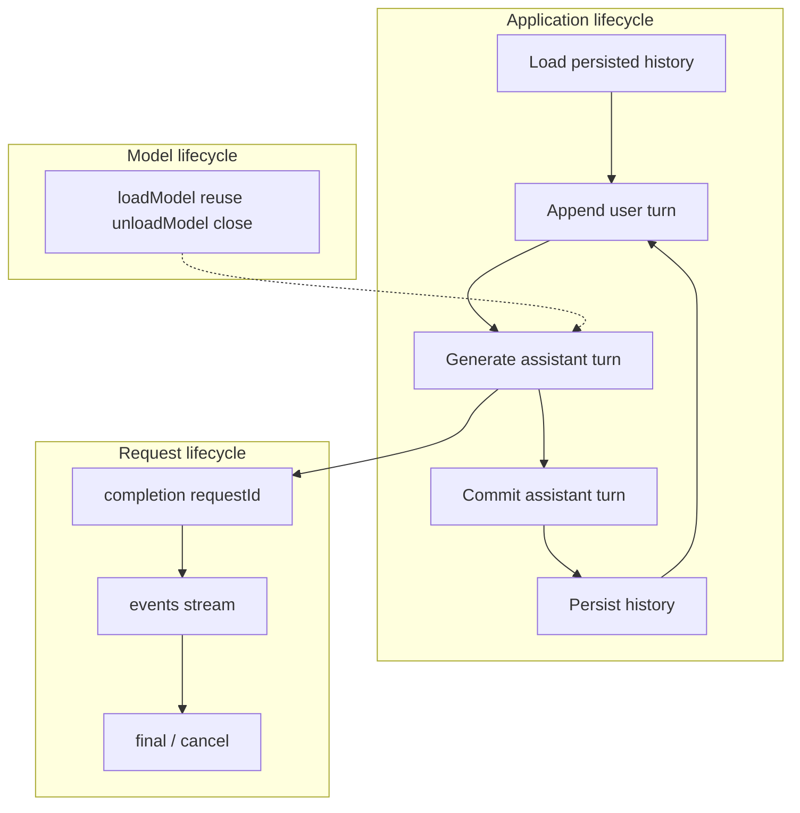

# Clase 4 — Build the Offline Chat

> **The Local-First AI Systems Masterclass** · Módulo 1 — Your First Local Token
> **Baseline técnico:** QVAC SDK v0.18.x / v0.18.1, verificado contra la documentación oficial y npm el 2026-08-26.

---

## Pregunta esencial

> **¿Cómo convertimos la inferencia local en una aplicación de conversación confiable que preserve estado, maneje interrupciones y siga funcionando tras reinicio sin la nube?**

---

## Resultados de aprendizaje

Al terminar esta lección puedes:

1. **Distinguir** estado de inferencia de estado de aplicación.
2. **Representar** conversación multi-turno como historial ordenado.
3. **Construir** bucle de chat event-driven con `events` + `final`.
4. **Commitear** salida del asistente solo tras estado terminal válido.
5. **Cancelar** completion en vuelo con `requestId`.
6. **Manejar** cancelación separada de errores inesperados.
7. **Persistir** historial comprometido localmente.
8. **Restaurar** conversación tras reinicio del proceso.
9. **Reutilizar** modelo cargado entre turnos.
10. **Aplicar** KV cache donde el runtime lo soporte.
11. **Exponer** métricas por turno sin confundirlas con rendimiento universal.
12. **Cerrar** recursos limpiamente (`unloadModel` / `close`).
13. **Verificar** chat en modo avión tras restart.
14. **Diagnosticar** fallo de consistencia de estado.
15. **Defender** política de cuándo persistir un turno.

---

## Por qué un demo de completion no es una aplicación

Imagina que tienes un script que llama `completion()` una vez y imprime el resultado. Funciona. El usuario dice: "Quiero hablar con esto como un chat."

Lo que falta no es "más prompts". Falta **arquitectura de aplicación**:

```text
model lifecycle
+
conversation state
+
request lifecycle
+
persistence
+
errors
+
user cancellation
+
metrics
+
shutdown
```

QVAC provee primitivas de inferencia y runtime. **Tu aplicación posee el estado del producto y la política de persistencia.**

---

## Tres ciclos de vida

Trata estos tres ciclos como independientes:

### 1. Model lifecycle

```text
find → download → validate → loadModel → reuse → unloadModel → close
```

El modelo es un activo pesado. Cargarlo una vez y reutilizarlo entre turnos es decisión de aplicación — y de rendimiento.

### 2. Request lifecycle

```text
completion() → events stream → final → (cancel?) → terminal state
```

Cada turno del usuario dispara un request con su propio `requestId`. Puede completarse, cancelarse o fallar.

### 3. Conversation lifecycle

```text
load history → append user turn → generate → commit assistant turn → persist → repeat
```

La conversación sobrevive requests individuales. Es estado de producto, no de runtime.



---

## Application state vs QVAC state

| Application state | Model / runtime state |
|---|---|
| conversation history | loaded weights |
| conversation id | runtime/backend |
| UI state | KV cache |
| persistence path | in-flight inference |
| active request id | |
| per-turn metrics | |

**Regla:** Si borras el archivo de transcript pero mantienes el modelo, pierdes la conversación pero puedes inferir. Si borras el modelo pero mantienes el transcript, tienes texto pero no puedes generar hasta volver a cargar/provisionar.

---

## Conversation history

Multi-turn behavior se produce pasando **historial previo** en cada `completion()`. El modelo no "recuerda" automáticamente entre llamadas aisladas.

```typescript
history: [
  { role: "user", content: "My favorite color for this test is orange." },
  { role: "assistant", content: "Got it — orange for this test." },
  { role: "user", content: "What color did I tell you?" },
]
```

Esto es **estado de aplicación**, no memoria a largo plazo del modelo.

---

## Dentro de QVAC: CompletionRun

En v0.18.x, `completion()` devuelve un `CompletionRun`:

| Campo | Uso en chat |
|---|---|
| `requestId` | Cancelación dirigida |
| `events` | Streaming incremental (`contentDelta`) |
| `final` | Texto agregado, stats, `stopReason` |

No enseñes superficies legacy como patrón preferido. El bucle de chat moderno lee eventos, renderiza provisionalmente, y espera `final` para decidir commit.

---

## Streaming UX

`contentDelta` permite mostrar texto mientras se genera. Pero **renderizar output parcial** y **commitear un turno de conversación** son operaciones separadas.

Flujo recomendado:

```text
buffer provisional (pantalla)
        ≠
committed history (durable)
```

El usuario ve el buffer crecer. Solo tras `final` con política de éxito mueves contenido al historial comprometido.

---

## La frontera de commit

Introduce explícitamente:

- **Provisional assistant output** — lo que se está streamando
- **Committed assistant turn** — lo que sobrevive restart

Política mínima:

| stopReason | ¿Commitear? |
|---|---|
| `eos` | Sí |
| `length` | Sí (parcial pero terminal) |
| `stopSequence` | Sí |
| `cancelled` | No (o según política documentada) |
| error mid-stream | No |

**Predict:** Si el usuario cancela tras 40 caracteres streamados, ¿deben persistirse como mensaje completo del asistente? Debes decidir y defender la política.

---

## Cancelación

Cancelación dirigida usa el `requestId` del run activo:

```typescript
import { cancel } from "@qvac/sdk";

await cancel({ requestId: activeRun.requestId });
```

Distingue:

- **User cancellation** — acción normal del producto (`/cancel`)
- **Runtime failure** — error inesperado
- **Length stop** — límite configurado, no error
- **Normal EOS** — fin natural

No captures todos los errores y los etiquetes "cancelled".

---

## Persistencia es responsabilidad de la aplicación

QVAC no provee chat database, conversation IDs, ni autosave. Implementa persistencia local con schema explícito:

```json
{
  "version": 1,
  "conversationId": "uuid",
  "createdAt": "2026-08-26T...",
  "updatedAt": "2026-08-26T...",
  "messages": [
    { "role": "user", "content": "..." },
    { "role": "assistant", "content": "..." }
  ]
}
```

Prácticas mínimas:

- validar schema al cargar;
- escribir de forma atómica (write temp + rename);
- manejar corrupción con mensaje claro al usuario.

No conviertas esto en una charla de bases de datos — JSON local es suficiente para v1.

---

## Restaurar una sesión

Al restart:

```text
1. load persisted history
2. loadModel (desde caché local si provisionado)
3. enter chat loop con history restaurada
```

Pesos del modelo y transcript son **activos separados**. Provisionar modelo ≠ restaurar conversación.

---

## KV cache en una aplicación de chat

Conecta con Clase 3: KV cache puede acelerar follow-ups cuando el runtime mantiene estado compatible. En chat multi-turno con sesión estable, puede ayudar — pero no es requisito para v1.

No confundas KV cache con "memoria conversacional". Es optimización de runtime, no almacenamiento de producto.

---

## Métricas por turno

Por cada turno completado, registra lo que la API expone:

- TTFT (wall-clock al primer `contentDelta`)
- duración total de generación
- `final.stats.tokensPerSecond` si disponible
- `final.stopReason`

Estas métricas describen **ese turno en tu máquina**, no "rendimiento de QVAC en general".

---

## Graceful shutdown

Secuencia controlada:

```text
cancel active request (si hay)
→ commit/persist pending state
→ unloadModel
→ close()  // shutdown explícito del SDK
```

En Node/Electron, `unloadModel()` del último modelo puede cerrar la conexión RPC automáticamente. En Bare el comportamiento difiere. Verifica en tu runtime — no asumas simetría.

---

## Worked Example — CLI incremental

Construye en capas (no dumps monolíticos):

1. Single completion (`examples/01`)
2. Multi-turn con history explícita (`02`)
3. Streaming render (`03`)
4. Cancel mid-stream (`04`)
5. Persist JSON (`05`)
6. Restart offline (`06`)

Luego integra en `app/src/` modular.

---

## Predict

> Si el usuario cancela después de 40 caracteres streamados, ¿esos caracteres deben almacenarse como mensaje completo del asistente?

Escribe tu política **antes** de implementar. No hay respuesta universal — hay tradeoffs de UX y consistencia.

---

## Build — Offline Chat v1

Implementa CLI que pasa acceptance tests A–G (ver README). Comandos sugeridos: `/exit`, `/cancel`, `/new`, `/history`, `/metrics`.

---

## Break It — Cancel Between Stream and Commit

Starter defectuoso (deliberado): escribe output parcial al archivo de historial **durante** el stream. Cancela a mitad. Restart. Inspecciona.

Diagnóstico esperado: la app confundió output provisional con estado durable. Fix: commit boundary explícita.

---

## Measure It

Tabla por turno con TTFT, duración, tok/s, stopReason. Compara turno normal vs cancelado.

---

## Airplane-Mode Verification

Precondición exacta: **activos del modelo ya provisionados localmente**.

```text
close app
→ disable network
→ restart app
→ restore transcript
→ loadModel from cache
→ new completion
```

Sin red no puedes provisionar por primera vez — eso es Clase 1, no Clase 4.

---

## Misconcepciones comunes

1. **El modelo recuerda el chat automáticamente** — No; la app debe pasar history.
2. **Streaming output ya es estado durable** — No; es provisional hasta commit.
3. **Cancelación siempre es error inesperado** — No; es acción normal del producto.
4. **Persistir user y assistant en momentos arbitrarios no corrompe semántica** — Sí puede; define frontera de commit.
5. **Unload y close son idénticos en todo runtime** — Verifica documentación actual.
6. **Offline significa que nunca necesité provisionar** — Falso; solo reutilizas lo ya local.

---

## Conexiones arquitectónicas

**Backward:** Clase 3 — primitivos de inferencia (`events`/`final`, TTFT, stopReason).

**Forward:**

- Clase 5 — embeddings como representación de significado externo
- Clase 6 — RAG añade conocimiento privado a esta arquitectura de chat

---

## Checkpoint

Responde las 7 preguntas en [`assessment/checkpoint.md`](assessment/checkpoint.md).

---

## Takeaway

> **Un chat confiable es una máquina de estados alrededor de inferencia, no un loop alrededor de una función prompt.**

---

## Fuentes utilizadas

- QVAC Text Generation docs v0.18.x
- QVAC API Summary / JS SDK docs
- Release notes verificadas 2026-08-26
