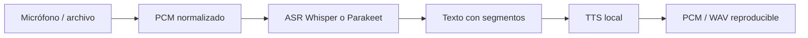

# Clase 7 — Speech Systems: ASR and TTS

> **Pregunta esencial:** ¿Cómo convertimos audio continuo en una conversación local medible, sin confundir bytes, texto y voz?

## Resultados de aprendizaje

Al terminar puedes:

1. distinguir PCM, contenedor y códec;
2. validar sample rate, canales, endianess y profundidad;
3. explicar el flujo ASR: frames → features → tokens → segmentos;
4. elegir Whisper o Parakeet según latencia, idioma y hardware;
5. manejar ventanas, solapamiento, VAD y timestamps;
6. producir TTS desde texto y verificar el formato de salida;
7. separar latencia de primer texto (TTFT) de primer audio (TTFA);
8. diseñar un relay con correlación, backpressure y cancelación;
9. medir privacidad y rendimiento con evidencia local;
10. diagnosticar incompatibilidades de audio sin inventar métricas.

## El modelo mental: una tubería con contratos



Cada frontera tiene un contrato. PCM es una secuencia de muestras, no “audio” abstracto. Declara `sampleRate`, `channels`, `sampleFormat`, `endianness` y `durationMs`. Un WAV puede contener PCM, pero MP3 y Opus requieren decodificación antes de entrar en un backend que espera muestras.

## ASR: de muestras a texto

ASR suele acumular una ventana de audio, extraer representación espectral y decodificar tokens. Whisper es una referencia generalista robusta; Parakeet puede ser atractivo cuando el backend y el hardware favorecen throughput. La elección debe depender de idioma, ruido, memoria, latencia y licencia, no sólo de WER de un benchmark externo.

En streaming, una ventana necesita contexto a ambos lados. El solapamiento mejora palabras en la frontera pero duplica trabajo. VAD evita inferir silencio; también puede cortar consonantes si el umbral es agresivo. Conserva `segmentId`, `startMs`, `endMs`, `text` y una marca de confianza sólo si el backend realmente la proporciona.

## TTS: texto no es audio

TTS transforma texto normalizado en una secuencia de muestras. El resultado debe declarar el mismo contrato de audio que espera el reproductor. No asumas que el sample rate del sintetizador coincide con el micrófono: el relay puede necesitar resampling, pero debe medir y documentar esa conversión.

Para UX, “tiempo hasta primer audio” y “duración para completar la síntesis” son métricas distintas. Reproducir chunks inmediatamente reduce tiempo percibido, pero exige backpressure: si el consumidor no alcanza al productor, limita el buffer o cancela con una razón explícita.

## Voice relay

Un relay mínimo mantiene un estado por turno:

```ts
type Turn = {
  id: string
  audio: { sampleRate: number; channels: number; sampleFormat: 's16le' }
  transcript?: { text: string; segments: Segment[] }
  speech?: { sampleRate: number; channels: number; pcmBytes: number }
  state: 'capturing' | 'transcribing' | 'synthesizing' | 'done' | 'cancelled' | 'error'
}
```

No conectes un micrófono directamente a TTS sin una frontera de observabilidad. Registra eventos `audioFrame`, `transcriptFinal`, `speechChunk`, `turnDone` y `turnError` con el mismo `turnId`. La cancelación debe detener ASR/TTS y liberar buffers; un error de formato no debe etiquetarse como “silencio”.

## Métricas y privacidad

Mide al menos: duración capturada, ASR first-text, ASR final, TTS first-audio, TTS total, bytes de entrada/salida y razón terminal. Reporta hardware, modelo, cuantización, sample rate y tamaño de ventana. Para demostrar local-first, ejecuta con red bloqueada y conserva logs que indiquen que no hubo endpoint remoto; “funcionó offline” sin evidencia no es una prueba.

## Break It → Measure It

Predice qué ocurre si envías 16 kHz a un backend configurado para 48 kHz, si inviertes endianess o si el consumidor de TTS duerme. Luego ejecuta una sola variación. Clasifica el resultado: fallo explícito, degradación de WER, audio acelerado/lento, buffer creciente o timeout. La reparación debe estar sustentada por el contrato y una nueva medición.

## Referencias

- [QVAC AI capabilities](https://docs.qvac.tether.io/ai-capabilities/)
- [QVAC API reference](https://docs.qvac.tether.io/reference/api/)
- [Whisper](https://github.com/ggerganov/whisper.cpp)
- [Parakeet](https://github.com/NVIDIA/NeMo)

