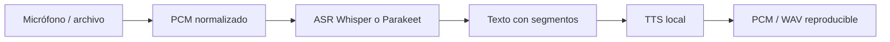

# Clase 7 — Speech Systems: ASR and TTS

> **The Local-First AI Systems Masterclass** · Módulo 3 — Beyond Text
> **Baseline técnico:** QVAC SDK v0.18.x / v0.18.1, verificado contra la documentación oficial y npm el 2026-08-25. Revisa las release notes antes de impartir esta clase.

---

## Introducción

Una tubería de voz local convierte audio continuo en texto y vuelve a convertir texto en audio reproducible. Cada frontera — captura, ASR, TTS — exige un contrato explícito de formato. Sin ese contrato, los bytes se confunden con significado y la latencia se mezcla con errores de formato.

Esta clase define los términos, el flujo observable ASR → TTS y un relay mínimo con correlación, backpressure y medición. El objetivo no es una demo que reproduce un archivo, sino una tubería cancelable y verificable offline.

---

## Qué aprenderás

1. **Distinguir** PCM, contenedor (WAV) y códec; validar sample rate, canales, endianness y profundidad.
2. **Explicar** el flujo ASR: frames → features → tokens → segmentos.
3. **Elegir** Whisper o Parakeet según idioma, ruido, memoria, latencia y licencia — no solo WER de un benchmark externo.
4. **Manejar** ventanas, solapamiento, VAD y timestamps en streaming.
5. **Producir** TTS desde texto y verificar el formato de salida.
6. **Separar** latencia de primer texto (TTFT) de primer audio (TTFA) y de la duración total.
7. **Diseñar** un voice relay con correlación, backpressure y cancelación.
8. **Medir** privacidad y rendimiento con evidencia local reproducible.
9. **Diagnosticar** incompatibilidades de audio sin inventar métricas.

---

## Definición y contexto

El audio crudo del micrófono o de un archivo no es “texto” ni “voz sintetizada”. Es una secuencia de muestras PCM con propiedades físicas: frecuencia de muestreo, canales, profundidad de bits y endianness. ASR consume esas muestras y emite texto; TTS consume texto y emite muestras. Un relay conecta ambas etapas sin perder observabilidad.

Cada frontera tiene un contrato. Un backend que espera PCM mono a 16 kHz rechazará o degradará audio a 48 kHz sin conversión documentada. Un error de formato no debe etiquetarse como “silencio” ni persistirse como transcripción vacía.



Whisper es una referencia generalista robusta; Parakeet puede ser atractivo cuando el backend y el hardware favorecen throughput. La elección depende del hardware, no de una promesa genérica.

---

## Términos

### Índice rápido

| Término | Definición breve |
|---|---|
| **Audio contract** | Declaración explícita de sampleRate, channels, sampleFormat, endianness y durationMs |
| **PCM / WAV** | Muestras crudas vs. contenedor que puede envolver PCM |
| **ASR** | Automatic Speech Recognition: audio → texto |
| **TTS** | Text-to-Speech: texto → audio |
| **Partial vs final transcript** | Hipótesis provisional vs. segmento estable para downstream |
| **segmentId** | Identificador monótono que correlaciona eventos de un segmento |
| **VAD** | Voice Activity Detection: detecta voz vs. silencio |
| **Voice relay** | Pipeline observable que encadena captura → ASR → TTS |
| **TTFT / TTFA** | Time to first text / time to first audio |

### Audio contract

**Definición:** Contrato que declara las propiedades físicas del audio antes de cualquier inferencia.

**Uso:** Validar entrada y salida en cada frontera del relay. Sin contrato, un backend interpreta bytes incorrectamente.

**Sintaxis / API:**

| Campo | Tipo | Descripción |
|---|---|---|
| `sampleRate` | `number` | Muestras por segundo (p. ej. 16000, 22050, 48000) |
| `channels` | `number` | 1 = mono, 2 = estéreo |
| `sampleFormat` | `'s16le'` | 16-bit signed little-endian (convención del bootcamp) |
| `endianness` | implícito en `s16le` | Little-endian para PCM estándar |
| `durationMs` | `number` | Duración calculada desde bytes y formato |

**Ejemplo:**

```ts
type AudioFormat = {
  sampleRate: number
  channels: number
  sampleFormat: 's16le'
}
const format: AudioFormat = { sampleRate: 16_000, channels: 1, sampleFormat: 's16le' }
const pcm = new Uint8Array(format.sampleRate * 2) // 1 s, 16-bit mono
const durationMs = pcm.byteLength / (format.sampleRate * format.channels * 2) * 1000
console.log({ format, durationMs })
```

**Resultado:** Objeto `{ format, durationMs: 1000 }` antes de llamar a ASR o TTS.

**Nota:** Un WAV puede contener PCM, pero MP3 y Opus requieren decodificación previa. El contrato aplica a las muestras, no al contenedor.

### PCM / WAV

**Definición:** PCM es una secuencia de muestras de amplitud; WAV es un contenedor de archivo que suele envolver PCM con un header RIFF.

**Uso:** Normalizar cualquier entrada a PCM con propiedades declaradas antes de ASR. Verificar el header WAV antes de extraer muestras.

**Sintaxis / API:** No hay función única del SDK; la validación es responsabilidad de la aplicación.

**Ejemplo:**

```ts
// Contrato mínimo antes de inferir
function validatePcm(pcm: Uint8Array, format: AudioFormat): void {
  const bytesPerSample = 2 // s16le
  const expected = format.sampleRate * format.channels * bytesPerSample
  if (pcm.byteLength % (format.channels * bytesPerSample) !== 0) {
    throw new Error('PCM length incompatible with channels and sampleFormat')
  }
}
```

**Resultado:** Error explícito si los bytes no coinciden con el contrato, en lugar de una transcripción vacía.

**Nota:** Invertir endianness o enviar 16 kHz a un backend de 48 kHz produce audio acelerado/lento o WER degradado — no un fallo silencioso.

### ASR

**Definición:** Automatic Speech Recognition — sistema que convierte audio en texto, típicamente por ventanas acumuladas, extracción espectral y decodificación de tokens.

**Uso:** Primera etapa del relay: transformar PCM en texto con segmentos y timestamps.

**Sintaxis / API:** Depende del runtime QVAC instalado (Whisper, Parakeet u otro). Adapta los nombres al cliente de tu entorno; conserva el contrato de eventos.

| Evento | Campos clave |
|---|---|
| `audioFrame` | `turnId`, `bytes` |
| `transcriptPartial` | `turnId`, `segmentId`, `text`, `final: false` |
| `transcriptFinal` | `turnId`, `segmentId`, `text`, `segments[]`, `final: true` |

**Ejemplo:**

```ts
const events = [
  { type: 'audioFrame', turnId: 'demo', bytes: 32000 },
  {
    type: 'transcriptFinal',
    turnId: 'demo',
    segmentId: 0,
    text: 'Hola mundo',
    final: true,
    segments: [{ segmentId: 0, startMs: 0, endMs: 1200, text: 'Hola mundo' }],
  },
]
for (const event of events) console.log(JSON.stringify(event))
```

**Resultado:** Log JSON con eventos ordenados por `turnId` y `segmentId`.

**Nota:** Whisper es generalista; Parakeet puede ganar en throughput en hardware compatible. Compara idioma, ruido, memoria, latencia y licencia — no solo WER de un benchmark ajeno.

### TTS

**Definición:** Text-to-Speech — sistema que transforma texto normalizado en una secuencia de muestras PCM.

**Uso:** Segunda etapa del relay: convertir el texto final (no parcial) en audio reproducible.

**Sintaxis / API:** Depende del sintetizador local provisionado. La salida debe declarar el mismo contrato que espera el reproductor.

| Campo de salida | Tipo | Descripción |
|---|---|---|
| `sampleRate` | `number` | Frecuencia del audio sintetizado |
| `channels` | `number` | Canales de salida |
| `sampleFormat` | `'s16le'` | Formato de muestra |
| `pcmBytes` | `number` | Tamaño del buffer PCM |

**Ejemplo:**

```ts
const speech = {
  sampleRate: 22_050,
  channels: 1,
  sampleFormat: 's16le' as const,
  pcmBytes: 44100,
}
console.log('TTS output contract:', speech)
```

**Resultado:** Contrato verificable antes de reproducir. Si `sampleRate` del sintetizador ≠ del reproductor, el relay necesita resampling documentado.

**Nota:** Reproducir chunks inmediatamente reduce tiempo percibido, pero exige backpressure. No asumas que el sample rate del sintetizador coincide con el del micrófono.

### Partial vs final transcript

**Definición:** Un transcript **partial** es una hipótesis provisional que puede cambiar; un transcript **final** es un segmento estable listo para downstream (TTS, persistencia).

**Uso:** Mostrar parciales en UI para feedback; enviar solo finales a TTS y almacenamiento durable.

**Sintaxis / API:**

| Campo | Partial | Final |
|---|---|---|
| `final` | `false` | `true` |
| Uso en UI | Actualizar texto en vivo | Confirmar turno |
| Uso en TTS | No sintetizar | Sintetizar |
| Persistencia | No guardar como turno | Guardar |

**Ejemplo:**

```ts
// Partial: actualiza UI, no va a TTS
onEvent({ type: 'transcriptPartial', segmentId: 1, text: 'Hola mun', final: false })
// Final: estable, puede ir a TTS
onEvent({ type: 'transcriptFinal', segmentId: 1, text: 'Hola mundo', final: true })
```

**Resultado:** La UI muestra progreso; TTS recibe solo texto estable.

**Nota:** Persistir un partial como turno final produce frases truncadas o duplicadas. La política segura sintetiza únicamente `final: true`.

### segmentId

**Definición:** Identificador numérico o string monótono que correlaciona todos los eventos de un segmento de habla.

**Uso:** Ordenar, cancelar y descartar resultados obsoletos cuando eventos llegan fuera de orden.

**Sintaxis / API:** Presente en `transcriptPartial`, `transcriptFinal`, `speechChunk` y eventos de error.

**Ejemplo:**

```ts
const turnId = crypto.randomUUID()
for (const type of ['audioFrame', 'transcriptFinal', 'speechChunk', 'turnDone']) {
  console.log({ type, turnId, segmentId: 0 })
}
```

**Resultado:** Todos los eventos de un turno comparten `turnId`; cada segmento tiene su `segmentId`.

**Nota:** Un evento tardío con `segmentId` anterior no debe sobrescribir el estado actual del relay.

### VAD

**Definición:** Voice Activity Detection — técnica que distingue voz de silencio en un stream de audio.

**Uso:** Evitar inferir silencio como ruido; reducir cómputo en pausas. En streaming, controla cuándo abrir y cerrar ventanas.

**Sintaxis / API:** Configuración del backend ASR o módulo previo a inferencia. Umbral agresivo puede cortar consonantes finales.

| Parámetro | Efecto |
|---|---|
| Umbral bajo | Más frames enviados a ASR; más falsos positivos |
| Umbral alto | Menos cómputo; riesgo de truncar palabras |
| Solapamiento | Mejora palabras en frontera de ventana; duplica trabajo |

**Ejemplo:** Ventana de 1 s con solapamiento de 200 ms vs. ventana completa del clip — compara WER y latencia en el lab.

**Resultado:** Tabla comparativa con first text, final text y razón terminal por configuración de ventana.

**Nota:** VAD no reemplaza el contrato de audio. Un silencio real y un error de formato deben distinguirse en logs.

### Voice relay

**Definición:** Pipeline observable que encadena captura PCM → ASR → TTS con estado por turno, eventos correlacionados y políticas de cancelación.

**Uso:** Construir conversaciones locales medibles sin conectar micrófono directamente a TTS.

**Sintaxis / API:**

```ts
type Turn = {
  id: string
  audio: { sampleRate: number; channels: number; sampleFormat: 's16le' }
  transcript?: { text: string; segments: Segment[] }
  speech?: { sampleRate: number; channels: number; pcmBytes: number }
  state: 'capturing' | 'transcribing' | 'synthesizing' | 'done' | 'cancelled' | 'error'
}
```

Eventos mínimos: `audioFrame`, `transcriptFinal`, `speechChunk`, `turnDone`, `turnError` — todos con el mismo `turnId`.

**Ejemplo:**

```ts
const turnId = crypto.randomUUID()
for (const type of ['audioFrame', 'transcriptFinal', 'speechChunk', 'turnDone']) {
  console.log({ type, turnId })
}
```

**Resultado:** Traza ordenada por turno, lista para logs y diagnóstico.

**Nota:** La cancelación debe detener ASR/TTS y liberar buffers. No conectes callbacks sin frontera de observabilidad.

### TTFT / TTFA

**Definición:** TTFT (time to first text) mide cuándo ASR emite la primera hipótesis útil; TTFA (time to first audio) mide cuándo TTS produce el primer chunk reproducible.

**Uso:** Separar latencia percibida de duración total. Son métricas distintas de `asrFinalMs` y `ttsTotalMs`.

**Sintaxis / API:** Medición con `performance.now()` alrededor de eventos.

| Métrica | Inicio | Fin |
|---|---|---|
| `asrFirstTextMs` (TTFT) | Fin de captura / inicio ASR | Primer `transcriptPartial` o `transcriptFinal` |
| `asrFinalMs` | Inicio ASR | Último `transcriptFinal` del turno |
| `ttsFirstAudioMs` (TTFA) | Texto final enviado a TTS | Primer `speechChunk` |
| `ttsTotalMs` | Inicio TTS | Último chunk o `turnDone` |

**Ejemplo:**

```ts
const t0 = performance.now()
// ... ASR ...
const ttft = performance.now() - t0 // primer texto
// ... TTS ...
const ttfa = performance.now() - t0 // primer audio
console.log({ ttft, ttfa })
```

**Resultado:** Cuatro números independientes por turno, no un solo “latency” agregado.

**Nota:** Depende del hardware, modelo, cuantización y tamaño de ventana. No compares máquinas distintas sin declararlo.

---

## Referencia QVAC

QVAC SDK v0.18.x expone capacidades de audio a través del mismo ciclo de vida que texto: provisionar, cargar, inferir, descargar. Los nombres exactos de funciones ASR/TTS dependen del runtime y modelos instalados — adapta al cliente de tu entorno y conserva los contratos de eventos de esta lección.

### Provisionar modelos de audio

**Definición:** Descargar pesos ASR/TTS al caché local antes de operar offline.

**Uso:** Misma fase que Clase 1–2: `downloadAsset()` con constantes de catálogo o rutas locales.

| Parámetro | Tipo | Descripción |
|---|---|---|
| `assetSrc` | `CatalogConstant \| string` | Modelo Whisper, Parakeet, TTS u origen local |
| `onProgress` | `(p) => void` | Progreso de descarga |

```ts
import { downloadAsset } from '@qvac/sdk'
// Adapta la constante al modelo ASR/TTS de tu catálogo
await downloadAsset({ assetSrc: 'YOUR_ASR_MODEL_CONSTANT' })
```

**Resultado:** Pesos en caché local. La inferencia posterior no requiere red.

**Nota:** Verifica con red bloqueada que no hay sockets remotos durante inferencia.

### Cargar modelo ASR o TTS

**Definición:** `loadModel()` coloca pesos en memoria y devuelve un `modelId`.

**Uso:** Cargar una vez por sesión; reutilizar `modelId` en múltiples turnos.

| Parámetro | Tipo | Descripción |
|---|---|---|
| `modelSrc` | `CatalogConstant \| string` | Origen del modelo |
| `modelConfig` | `object` | Configuración del runtime (ctx, threads, etc.) |

```ts
import { loadModel } from '@qvac/sdk'
const asrModelId = await loadModel({ modelSrc: 'YOUR_ASR_MODEL_CONSTANT' })
const ttsModelId = await loadModel({ modelSrc: 'YOUR_TTS_MODEL_CONSTANT' })
```

**Resultado:** Instancias residentes hasta `unloadModel()`.

**Nota:** Entre experimentos, descarga modelos para no agotar memoria en el worker compartido.

### Ejecutar ASR

**Definición:** Enviar PCM normalizado al runtime y recibir eventos de transcripción.

**Uso:** Pasar audio que cumple el contrato; escuchar eventos partial y final.

| Entrada | Tipo | Descripción |
|---|---|---|
| `modelId` | `string` | Modelo ASR cargado |
| `audio` | `Uint8Array` | PCM según contrato |
| `format` | `AudioFormat` | sampleRate, channels, sampleFormat |

```ts
// Pseudocódigo — adapta al cliente ASR de tu runtime QVAC
async function transcribe(asrModelId: string, pcm: Uint8Array, format: AudioFormat) {
  validatePcm(pcm, format)
  // const run = asr({ modelId: asrModelId, audio: pcm, format, stream: true })
  // for await (const ev of run.events) { … }
}
```

**Resultado:** Eventos `transcriptPartial` y `transcriptFinal` con `segmentId`, `startMs`, `endMs`.

**Nota:** Si el backend rechaza el formato, el error debe identificar la propiedad incompatible.

### Ejecutar TTS

**Definición:** Enviar texto final al sintetizador y recibir PCM de salida.

**Uso:** Solo después de `transcriptFinal`. Verificar contrato de salida antes de reproducir.

| Entrada | Tipo | Descripción |
|---|---|---|
| `modelId` | `string` | Modelo TTS cargado |
| `text` | `string` | Texto final a sintetizar |

```ts
// Pseudocódigo — adapta al cliente TTS de tu runtime QVAC
async function synthesize(ttsModelId: string, text: string) {
  // const run = tts({ modelId: ttsModelId, text })
  // return { sampleRate, channels, pcmBytes, pcm }
  return { sampleRate: 22_050, channels: 1, sampleFormat: 's16le', pcmBytes: 0 }
}
```

**Resultado:** Buffer PCM con propiedades declaradas, listo para el reproductor.

### Descargar y cerrar

```ts
import { unloadModel, close } from '@qvac/sdk'
await unloadModel({ modelId: asrModelId, clearStorage: false })
await unloadModel({ modelId: ttsModelId, clearStorage: false })
void close()
```

---

## Ejemplo completo

Flujo mínimo: validar contrato → ASR → TTS → traza de eventos.

```ts
import crypto from 'node:crypto'

type AudioFormat = { sampleRate: number; channels: number; sampleFormat: 's16le' }

function validatePcm(pcm: Uint8Array, format: AudioFormat) {
  if (pcm.byteLength % (format.channels * 2) !== 0) throw new Error('invalid PCM length')
}

async function voiceRelayTurn(pcm: Uint8Array, format: AudioFormat) {
  const turnId = crypto.randomUUID()
  validatePcm(pcm, format)

  console.log(JSON.stringify({ type: 'audioFrame', turnId, bytes: pcm.byteLength }))

  // ASR — sustituye por cliente QVAC real
  const text = '<transcripción local>'
  const segmentId = 0
  console.log(JSON.stringify({
    type: 'transcriptFinal', turnId, segmentId, text, final: true,
    segments: [{ segmentId, startMs: 0, endMs: 1000, text }],
  }))

  // TTS — sustituye por cliente QVAC real
  const speech = { sampleRate: 22_050, channels: 1, pcmBytes: 44100 }
  console.log(JSON.stringify({ type: 'speechChunk', turnId, segmentId, bytes: speech.pcmBytes }))
  console.log(JSON.stringify({ type: 'turnDone', turnId, reason: 'completed' }))
}

const format: AudioFormat = { sampleRate: 16_000, channels: 1, sampleFormat: 's16le' }
const pcm = new Uint8Array(32_000)
await voiceRelayTurn(pcm, format)
```

Ejemplos ejecutables en [`examples/`](examples/) — adapta nombres de funciones al cliente QVAC instalado.

---

## Antes de ejecutar

Escribe tus respuestas antes del lab:

1. Envías PCM mono 16 kHz a un backend configurado para 48 kHz. ¿Qué predices: fallo explícito, WER degradado o audio acelerado?
2. Inviertes endianness en una muestra `s16le`. ¿El ASR devuelve silencio, basura o un error identificable?
3. Persistes un `transcriptPartial` como turno final. ¿Qué ocurre en TTS y en la UI?
4. El consumidor de TTS duerme 2 s entre chunks. ¿Crece el buffer o se aplica backpressure?
5. Cortas la red después de provisionar modelos. ¿Qué fase falla si falta un artefacto local?

---

## Práctica guiada

**Lab — Voice Contract Lab** (90 min). Guía completa en [`lab/README.md`](lab/README.md).

1. **Contrato:** completa `AudioFormat` y valida PCM antes de inferir.
2. **ASR batch:** registra texto, segmentos, duración y razón terminal.
3. **ASR ventanas:** compara ventana completa vs. ventanas de 1 s con solapamiento de 200 ms.
4. **TTS:** sintetiza la transcripción final y verifica sample rate, canales y bytes.
5. **Relay:** correlaciona un turno ASR → TTS con eventos ordenados por `turnId`.
6. **Medición:** llena la tabla TTFT/TTFA/total; declara hardware y modelo.
7. **Break It:** cambia solo sample rate o endianness; predice y diagnostica.
8. **Offline:** repite con red bloqueada; conserva comando, modelo y logs sin contenido de audio completo.

| corrida | modelo | formato entrada | first text | first audio | total | stop/error |
|---|---|---|---:|---:|---:|---|
| baseline | | | | | | |
| ventana | | | | | | |
| break-it | | | | | | |

Entrega `report.json` y una explicación de una página.

---

## Errores comunes

| Síntoma | Causa probable | Corrección |
|---|---|---|
| Transcripción vacía sin error | Formato incompatible enviado como silencio | Validar contrato antes de ASR; error explícito |
| Audio acelerado o lento | Sample rate de entrada ≠ configuración del backend | Normalizar o resamplear con conversión documentada |
| Buffer TTS crece sin límite | Sin backpressure; productor más rápido que consumidor | Limitar cola, cancelar con razón explícita |
| Frases truncadas en TTS | Partial persistido o enviado a sintetizador | Sintetizar solo `final: true` |
| WER peor en fronteras de palabra | Ventana sin solapamiento | Añadir solapamiento; medir tradeoff de latencia |
| "Funcionó offline" sin prueba | Sin logs ni verificación de sockets | Airplane-Mode Test con evidencia de artefactos locales |

---

## Medición

| Métrica | Cómo obtenerla | Unidad | Interpretación |
|---|---|---|---|
| Duración capturada | `pcm.byteLength / (sampleRate × channels × 2) × 1000` | ms | Entrada real al ASR |
| ASR first text (TTFT) | Primer evento de texto − inicio ASR | ms | Latencia percibida de transcripción |
| ASR final | Último `transcriptFinal` − inicio ASR | ms | Tiempo total de decodificación |
| TTS first audio (TTFA) | Primer `speechChunk` − envío de texto | ms | Latencia percibida de síntesis |
| TTS total | Fin de síntesis − inicio TTS | ms | Duración completa del sintetizador |
| Bytes entrada/salida | Tamaño PCM in/out | bytes | Carga de datos, no calidad |
| Razón terminal | Campo `reason` en `turnDone` / `turnError` | enum | completed, cancelled, error |

Reporta hardware, modelo, cuantización, sample rate y tamaño de ventana en cada corrida.

---

## Resumen

- El audio local empieza por un contrato: sampleRate, channels, sampleFormat, durationMs.
- ASR convierte PCM en texto con segmentos; TTS convierte texto final en PCM reproducible.
- Partial actualiza UI; final alimenta TTS y persistencia.
- Un voice relay correlaciona eventos por `turnId` y `segmentId`, con cancelación y backpressure.
- TTFT, TTFA, duración total y razón terminal son métricas distintas — no las agregues.
- La privacidad se demuestra con red bloqueada y logs, no con una afirmación.

**Siguiente clase:** encadenar ASR → traducción → TTS en un intérprete local (Clase 08).

---

## Definition of Done

- [ ] Tres archivos de entrada producen segmentos reproducibles.
- [ ] La UI distingue parcial, final, error y cancelación.
- [ ] ASR y TTS reportan primer resultado y duración total por separado.
- [ ] Un caso de sample rate incompatible queda diagnosticado y corregido.
- [ ] La prueba offline incluye evidencia de artefactos locales y ausencia de sockets remotos.
- [ ] El estudiante puede defender una decisión de ventana, solapamiento y VAD.

---

## Checkpoint

1. Muestra el contrato de audio de entrada y salida.
2. Explica por qué un resultado parcial no debe persistirse como turno final.
3. Diagnostica un audio reproducido demasiado rápido o lento.
4. Separa TTFT/primer texto de TTFA/primer audio y de la duración total.
5. Describe qué evidencia prueba localidad sin exponer el contenido de la conversación.

---

## Fuentes

- [QVAC — AI capabilities](https://docs.qvac.tether.io/ai-capabilities/)
- [QVAC — API reference v0.18.x](https://docs.qvac.tether.io/reference/api/)
- [Whisper (whisper.cpp)](https://github.com/ggerganov/whisper.cpp)
- [Parakeet (NVIDIA NeMo)](https://github.com/NVIDIA/NeMo)
