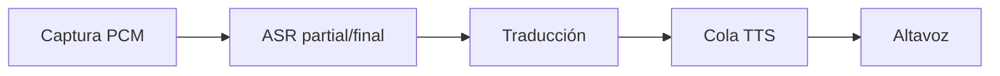

# Clase 8 — Translation and the Voice Relay

> **The Local-First AI Systems Masterclass** · Módulo 3 — Beyond Text
> **Baseline técnico:** QVAC SDK v0.18.x / v0.18.1, verificado contra la documentación oficial y npm el 2026-08-25. Revisa las release notes antes de impartir esta clase.

---

## Introducción

Un intérprete local encadena captura PCM, ASR, traducción y TTS sin enviar voz ni texto a la nube. La voz añade tiempo y estado que no aparecen en un chat de texto: hipótesis parciales, resultados fuera de orden y colas de reproducción. Sin contratos y políticas de cola, el relay repite palabras, habla frases viejas o acumula buffers imposibles de vaciar.

Esta clase extiende el voice relay de la Clase 07 con traducción local, cuatro relojes independientes, backpressure y medición de real-time factor (RTF).

---

## Qué aprenderás

1. **Descomponer** un intérprete en contratos de captura PCM, ASR, traducción y TTS.
2. **Distinguir** frames PCM, hipótesis parciales y segmentos finales.
3. **Elegir** una ruta local: `qvac-fabric-llm.cpp` para traducción generativa o Bergamot para traducción especializada.
4. **Encadenar** ASR → traducción → TTS sin bloquear la captura.
5. **Aplicar** `segmentId`, backpressure, cancelación y descarte de resultados obsoletos.
6. **Medir** primer audio, duración por etapa, RTF y errores por stage.
7. **Defender** qué datos permanecen locales y cómo falla cada etapa.

---

## Definición y contexto

La ruta local es: micrófono → PCM → ASR → texto → traductor → texto → TTS → altavoz. Ningún paso necesita un proveedor remoto si los modelos están provisionados con antelación. La privacidad se demuestra observando dependencias, sockets y artefactos en caché — no con una etiqueta.

Un ASR puede emitir hipótesis parciales que cambian al cerrar la frase. Una traducción parcial puede revertirse cuando llega el final. TTS necesita audio reproducible en orden. Si conectamos callbacks sin contratos, el sistema habla contenido obsoleto o se bloquea.



Tiempo real no significa que todas las etapas terminen a la vez. Cada etapa tiene su propio reloj.

---

## Términos

### Índice rápido

| Término | Definición breve |
|---|---|
| **Four clocks** | Cuatro dominios temporales: captura, ASR, traducción, TTS |
| **segmentId** | ID monótono que correlaciona eventos de un segmento |
| **Backpressure** | Política cuando el productor supera al consumidor |
| **Partial translation** | Traducción de hipótesis aún no final — puede cambiar |
| **Relay state** | Estado observable del pipeline por segmento y global |
| **qvac-fabric-llm vs Bergamot** | LLM generativo vs. traductor neuronal especializado |
| **RTF** | Real-time factor: tiempo de síntesis / duración del audio |

### Four clocks

**Definición:** Cuatro dominios temporales independientes en un intérprete: captura PCM, ASR, traducción y TTS/reproducción.

**Uso:** Diagnosticar cuellos de botella sin mezclar latencias. Cada reloj avanza a su ritmo.

**Sintaxis / API:**

| Reloj | Entrada | Salida | Bloquea captura |
|---|---|---|---|
| Captura | Micrófono | Frames PCM mono | — |
| ASR | PCM | `transcriptPartial` / `transcriptFinal` | No |
| Traducción | Texto final (o ventana estable) | `translation` | No |
| TTS | Texto traducido | PCM + reproducción | No |

**Ejemplo:**

```ts
// Cuatro timestamps independientes por segmento
const metrics = {
  captureToFinalMs: 820,
  translationMs: 140,
  ttsMs: 310,
  firstAudioMs: 45,
}
console.log(metrics)
```

**Resultado:** Tabla de latencias por etapa, no un solo número agregado.

**Nota:** TTS lento no debe bloquear la captura del siguiente segmento — eso es trabajo del relay y su política de colas.

### segmentId

**Definición:** Identificador monótono asignado a cada segmento de habla; correlaciona transcript, traducción y audio sintetizado.

**Uso:** Evitar que un evento tardío con ID anterior sobrescriba el estado actual.

**Sintaxis / API:** Presente en todos los contratos del relay.

```ts
{ type: 'transcript', segmentId: 2, text: '…', final: true }
{ type: 'translation', segmentId: 2, sourceText: '…', targetText: '…' }
{ type: 'audio', segmentId: 2, pcm, sampleRate: 22050, final: true }
```

**Ejemplo:**

```ts
let latestSegment = -1
function acceptSegment(segmentId: number): boolean {
  if (segmentId < latestSegment) return false // obsoleto
  latestSegment = Math.max(latestSegment, segmentId)
  return true
}
```

**Resultado:** Eventos fuera de orden se descartan sin corromper la cola TTS.

**Nota:** `segmentId` es distinto de `turnId` (Clase 07). Un turno puede contener varios segmentos.

### Backpressure

**Definición:** Mecanismo que limita el crecimiento de colas cuando el productor (ASR/traducción) supera al consumidor (TTS/reproductor).

**Uso:** Evitar buffers ilimitados y latencia acumulada en conversaciones rápidas.

**Sintaxis / API:** Política de aplicación — no una función del SDK.

| Política | Comportamiento | Cuándo usar |
|---|---|---|
| Bloquear con límite | Espera si cola ≥ N | Conversaciones pausadas |
| Descartar parciales | Solo conserva último partial | UI reactiva, TTS solo final |
| Degradar a texto | Omite TTS, muestra traducción | TTS no alcanza tiempo real |
| FIFO acotada | Cola ordenada con tamaño máximo | Conversación continua |

**Ejemplo (lab):** Conservar el último partial de cada segmento; limitar cola de finales a dos segmentos.

**Resultado:** `queueDepthMax` acotado y documentado en logs.

**Nota:** Una conversación rápida puede requerir FIFO ordenado en lugar de “solo el más reciente”. Documenta la política elegida.

### Partial translation

**Definición:** Traducción emitida antes de que ASR confirme el segmento final — puede cambiar o invalidarse.

**Uso:** Mostrar preview en UI; no reproducir como frase definitiva en TTS.

**Sintaxis / API:**

| Origen ASR | Política segura | Política de menor latencia |
|---|---|---|
| `final: false` | UI únicamente | Traducir + TTS provisional |
| `final: true` | Traducir + encolar TTS | Traducir + reemplazar provisional |

**Ejemplo:**

```ts
async function pushTranscript({ segmentId, text, final = false }) {
  onEvent({ type: 'asr', segmentId, text, final })
  if (!final) return // parcial: UI únicamente
  const targetText = await translate(text)
  onEvent({ type: 'translation', segmentId, sourceText: text, targetText })
  // … encolar TTS
}
```

**Resultado:** Parciales visibles en UI; TTS recibe solo contenido estable.

**Nota:** Si usas TTS provisional, debes cancelar o reemplazar el audio cuando llegue el final corregido.

### Relay state

**Definición:** Estado observable del pipeline: qué segmentos están en captura, transcripción, traducción, síntesis o reproducción.

**Uso:** Diagnosticar bloqueos, cancelaciones y resultados obsoletos.

**Sintaxis / API:**

```ts
type RelayState = {
  open: boolean
  latestSegment: number
  queueDepth: number
  segments: Map<number, {
    asr: 'partial' | 'final' | 'error'
    translation: 'pending' | 'done' | 'error'
    tts: 'pending' | 'playing' | 'done' | 'error'
  }>
}
```

**Ejemplo:**

```ts
export function createVoiceRelay({ translate, tts, onEvent = () => {} }) {
  let latestSegment = -1
  let closed = false
  return {
    async pushTranscript({ segmentId, text, final = false }) {
      if (closed || segmentId < latestSegment) return
      latestSegment = Math.max(latestSegment, segmentId)
      onEvent({ type: 'asr', segmentId, text, final })
      if (!final) return
      try {
        const targetText = await translate(text)
        if (closed || segmentId !== latestSegment) return
        const audio = await tts(targetText)
        if (closed || segmentId !== latestSegment) return
        await audio.play()
        onEvent({ type: 'played', segmentId })
      } catch (error) {
        onEvent({ type: 'stage-error', segmentId, error: String(error) })
      }
    },
    close() { closed = true; onEvent({ type: 'closed' }) },
  }
}
```

**Resultado:** Estado consultable en cualquier momento; cancelación vía `close()` detiene trabajo pendiente.

**Nota:** Verifica `closed` y `segmentId !== latestSegment` antes de reproducir — evita audio fantasma tras cancelar.

### qvac-fabric-llm vs Bergamot

**Definición:** Dos rutas locales de traducción: un LLM generativo vía `qvac-fabric-llm.cpp` vs. un traductor neuronal especializado (Bergamot).

**Uso:** Elegir según cobertura de idiomas, latencia, tamaño, calidad y licencia — la clase no prescribe una ruta universal.

**Sintaxis / API:**

| Criterio | qvac-fabric-llm.cpp | Bergamot |
|---|---|---|
| Flexibilidad | Alta — cualquier par vía prompt | Baja — pares soportados |
| Predecibilidad | Riesgo de texto extra del LLM | Salida más estructurada |
| Latencia | Depende del modelo GGUF | Típicamente menor para pares soportados |
| Tamaño | Modelo LLM multi-GB | Modelos por par, más compactos |
| Formato de salida | Exige prompt estricto | API de traducción directa |
| Offline | Sí, con GGUF provisionado | Sí, con modelos Bergamot en caché |

**Ejemplo (LLM como traductor):**

```ts
import { completion, loadModel } from '@qvac/sdk'

const run = completion({
  modelId,
  history: [{
    role: 'user',
    content: `Traduce al inglés. Responde SOLO con la traducción, sin explicación.\n\n${sourceText}`,
  }],
  stream: false,
})
const final = await run.final
const targetText = final.content.trim()
```

**Resultado:** Traducción local sin red. Calidad y formato dependen del prompt y del modelo.

**Nota:** Bergamot puede ser más predecible para pares soportados. Compara ambas rutas con la misma entrada ASR en el lab.

### RTF

**Definición:** Real-time factor — ratio entre tiempo de síntesis TTS y duración del audio producido: `RTF = ttsMs / audioDurationMs`.

**Uso:** Saber si TTS alcanza tiempo real. RTF &lt; 1 significa que la síntesis es más rápida que la reproducción; RTF &gt; 1 significa que no alcanza.

**Sintaxis / API:**

```ts
const rtf = ttsMs / audioDurationMs
// rtf < 1 → TTS más rápido que reproducción
// rtf > 1 → TTS más lento que reproducción (cola crece)
```

**Ejemplo:**

| segmentId | ttsMs | audioDurationMs | RTF |
|---:|---:|---:|---:|
| 1 | 280 | 1200 | 0.23 |
| 2 | 1500 | 900 | 1.67 |

**Resultado:** Segmento 2 no alcanza tiempo real — requiere backpressure o degradación.

**Nota:** En voz importa sostener el ritmo de reproducción, no solo la media de tok/s del LLM.

---

## Referencia QVAC

### Contratos mínimos del relay

**Definición:** Tipos de evento que atraviesan el pipeline. Todos llevan `segmentId`.

**Uso:** Interfaz entre captura, ASR, traducción y TTS sin acoplar implementaciones.

```
{ type: "audio", pcm, sampleRate: 16000, timestampMs }
{ type: "transcript", segmentId, text, final: false }
{ type: "transcript", segmentId, text, final: true }
{ type: "translation", segmentId, sourceText, targetText }
{ type: "audio", segmentId, pcm, sampleRate, final: true }
```

No confundas partial con contenido durable. La política segura traduce y sintetiza únicamente `final: true`.

### Traducción con qvac-fabric-llm.cpp

**Definición:** Usar `completion()` sobre un modelo GGUF cargado como traductor mediante prompt.

**Uso:** Pares de idioma no cubiertos por Bergamot o cuando ya tienes un LLM cargado.

| Parámetro | Tipo | Descripción |
|---|---|---|
| `modelId` | `string` | Modelo cargado con `loadModel()` |
| `history` | `{ role, content }[]` | Prompt con instrucción estricta de traducción |
| `stream` | `boolean` | `false` para traducción batch por segmento |

**Resultado:** Texto traducido en `final.content`. Filtra prefijos/sufijos no deseados del LLM.

**Nota:** Exige formato de salida estricto en el prompt. Un LLM conversacional puede añadir explicaciones.

### Traducción con Bergamot

**Definición:** Motor de traducción neuronal local especializado, integrado como adaptador en el relay.

**Uso:** Pares de idioma soportados donde predecibilidad y eficiencia superan la flexibilidad del LLM.

| Criterio | Implicación |
|---|---|
| Pares soportados | Verifica catálogo antes de provisionar |
| Artefactos | Modelos por par en caché local |
| API | Adaptador `translate(text) → targetText` en tu relay |

**Resultado:** Traducción directa sin prompt engineering. Latencia típicamente menor que un LLM 4B+.

**Nota:** Provisiona modelos con antelación. Sin artefacto local, el intérprete falla offline aunque ASR/TTS funcionen.

### ASR y TTS (Clase 07)

Reutiliza los contratos de la Clase 07: provisionar con `downloadAsset()`, cargar con `loadModel()`, validar PCM antes de ASR, sintetizar solo texto final.

---

## Ejemplo completo

Relay didáctico con traducción y TTS inyectables. Sustituye adaptadores por clientes QVAC reales.

```js
export function createVoiceRelay({ translate, tts, onEvent = () => {} }) {
  let latestSegment = -1
  let closed = false

  return {
    async pushTranscript({ segmentId, text, final = false }) {
      if (closed || segmentId < latestSegment) return
      latestSegment = Math.max(latestSegment, segmentId)
      onEvent({ type: 'asr', segmentId, text, final })
      if (!final) return

      try {
        const started = performance.now()
        const targetText = await translate(text)
        onEvent({
          type: 'translation', segmentId, sourceText: text,
          targetText, durationMs: performance.now() - started,
        })
        if (closed || segmentId !== latestSegment) return

        const ttsStarted = performance.now()
        const audio = await tts(targetText)
        if (closed || segmentId !== latestSegment) return

        await audio.play()
        onEvent({
          type: 'played', segmentId,
          ttsMs: performance.now() - ttsStarted,
        })
      } catch (error) {
        onEvent({ type: 'stage-error', segmentId, error: String(error) })
      }
    },
    close() { closed = true; onEvent({ type: 'closed' }) },
  }
}

export const fakeTranslate = async (text) => text.replace('hola', 'hello')
export const fakeTts = async (text) => ({ play: async () => text })
```

Ejemplo ejecutable en [`examples/relay-pipeline.js`](examples/relay-pipeline.js).

---

## Antes de ejecutar

Predice antes del lab:

1. TTS tarda más que ASR: ¿crece la cola o se descartan segmentos?
2. Traducción falla en segmento 3: ¿se bloquean segmentos 4 y 5?
3. Final del segmento 2 llega después del 3: ¿se reproduce audio obsoleto?
4. Cierras el relay durante TTS: ¿se oye audio después de apagarlo?
5. Cortas la red antes de iniciar: ¿qué artefacto local falta?

---

## Práctica guiada

**Lab — Construye un intérprete local.** Guía en [`lab/README.md`](lab/README.md).

1. Provisiona modelos ASR y TTS de la Clase 07.
2. Elige y registra Bergamot o `qvac-fabric-llm.cpp`.
3. Comprueba caché y dependencias; deshabilita la red antes de la corrida.
4. Define contratos PCM, transcript, traducción y audio.
5. Muestra parciales en UI; envía solo final a traducción.
6. Fuerza TTS lento, falla traducción en un segmento y cierra durante TTS.
7. Guarda eventos JSON, latencias y decisión de arquitectura.

| segmentId | ASR final ms | traducción ms | TTS ms | primer audio ms | RTF | resultado |
|---:|---:|---:|---:|---:|---:|---|
| 1 | | | | | | |
| 2 | | | | | | |
| 3 | | | | | | |
| 4 | | | | | | |
| 5 | | | | | | |

No basta con oír una frase: demuestra ausencia de red, orden, manejo de parciales y recuperación ante fallos.

---

## Errores comunes

| Síntoma | Causa probable | Corrección |
|---|---|---|
| Repite palabras en TTS | Partial traducido y sintetizado | Solo final a traducción/TTS |
| Habla frases viejas | Evento tardío sin check de `segmentId` | Descartar si `segmentId < latestSegment` |
| Cola crece sin límite | Sin backpressure; RTF &gt; 1 | FIFO acotada, degradar a texto o descartar |
| Bloqueo tras error en traducción | Sin aislamiento por segmento | `stage-error` por segmento; continuar siguientes |
| Audio tras cancelar | No verificar `closed` antes de reproducir | Guard `closed` y `segmentId !== latestSegment` |
| LLM añade explicación | Prompt laxo | Instrucción estricta: solo traducción |
| Falla offline sin diagnóstico | Modelo de traducción no provisionado | Verificar caché antes de cortar red |

---

## Medición

| Métrica | Cómo obtenerla | Unidad | Interpretación |
|---|---|---|---|
| `captureToFinalMs` | Final ASR − inicio captura del segmento | ms | Latencia de transcripción |
| `translationMs` | Fin traducción − inicio traducción | ms | Costo del traductor |
| `ttsMs` | Fin síntesis − inicio TTS | ms | Costo del sintetizador |
| `firstAudioMs` | Primer sample reproducido − final ASR | ms | Latencia end-to-end percibida |
| `audioDurationMs` | Duración del PCM sintetizado | ms | Longitud del audio hablado |
| `queueDepthMax` | Máximo de segmentos en cola TTS | count | Presión del pipeline |
| `droppedPartials` | Parciales descartados por política | count | Agresividad de backpressure |
| `stageErrors` | Errores por etapa (ASR/trad/TTS) | count | Aislamiento de fallos |
| **RTF** | `ttsMs / audioDurationMs` | ratio | &lt; 1 = tiempo real; &gt; 1 = cola crece |

Reporta traductor elegido (Bergamot vs LLM), modelos, hardware y política de cola.

---

## Resumen

- Un intérprete local es una cadena de contratos: PCM → transcript → translation → audio.
- Cuatro relojes independientes: captura, ASR, traducción, TTS — no mezclar métricas.
- `segmentId` evita resultados fuera de orden; partial actualiza UI, final alimenta downstream.
- Backpressure es obligatoria cuando RTF &gt; 1 o la conversación es rápida.
- Bergamot y `qvac-fabric-llm.cpp` son rutas distintas — elige con cobertura, latencia y predecibilidad.
- La privacidad se demuestra con modelos provisionados, red bloqueada y logs de sockets.

**Fin del Módulo 3 — Beyond Text.**

---

## Definition of Done

- [ ] Cinco segmentos traducidos y sintetizados sin red.
- [ ] Parciales actualizan UI, pero no se reproducen como frases definitivas.
- [ ] `segmentId` evita resultados fuera de orden.
- [ ] Fallos de traducción/TTS se reportan por etapa.
- [ ] Backpressure y `queueDepthMax` están documentados.
- [ ] Break It incluye predicción, observación y explicación.
- [ ] Tabla de latencias para al menos cinco segmentos.

---

## Checkpoint

1. ¿Por qué el relay necesita cuatro contratos?
2. ¿Cuál es la diferencia entre partial y final de ASR?
3. ¿Cuándo elegirías Bergamot frente a un LLM local?
4. ¿Qué hace `segmentId` ante resultados fuera de orden?
5. ¿Qué significa RTF?
6. ¿Qué política aplicarías si TTS no alcanza tiempo real?
7. ¿Qué evidencia demuestra que no hubo red?

---

## Fuentes

- [QVAC — AI capabilities](https://docs.qvac.tether.io/ai-capabilities/)
- [QVAC — API reference v0.18.x](https://docs.qvac.tether.io/reference/api/)
- [QVAC — Text generation (qvac-fabric-llm.cpp)](https://docs.qvac.tether.io/ai-capabilities/text-generation/)
- [Bergamot (Mozilla)](https://github.com/mozilla/bergamot-translator)
- Clase 07 — [`class-07-speech-systems/lesson.md`](../class-07-speech-systems/lesson.md)
