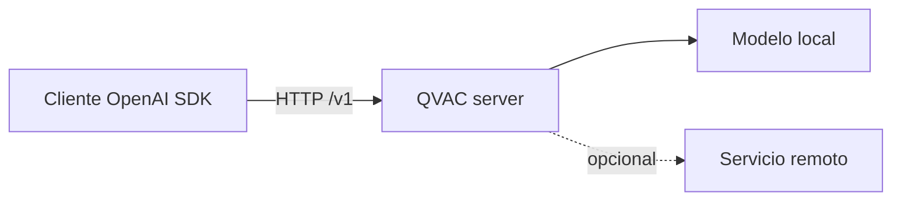

# Clase 9 — The OpenAI-Compatible Escape Hatch

> **Módulo 4 — Drop-in Sovereignty** · QVAC SDK v0.18.x / v0.18.1

## Pregunta esencial

> ¿Cómo cambiamos una aplicación de un proveedor remoto a inferencia local sin reescribir su cliente, y cómo demostramos qué dependencias permanecen?

## Resultados de aprendizaje

Al terminar puedes:

1. Explicar qué resuelve y qué no resuelve una API OpenAI-compatible.
2. Configurar `baseURL` como frontera de colocación, sin codificar secretos en el código.
3. Usar `/v1/models` y `/v1/chat/completions` para comprobar el contrato.
4. Consumir una respuesta normal y un stream SSE (`data: ...`, `[DONE]`).
5. Migrar un cliente conservando mensajes, parámetros y manejo de errores.
6. Detectar incompatibilidades de modelo, herramienta, visión y JSON estructurado.
7. Separar dependencia de red, dependencia del servidor y dependencia del modelo.
8. Medir TTFT, duración, tok/s y tamaño de respuesta en ambas rutas.
9. Diseñar un fallback explícito y fail-closed cuando los datos son privados.
10. Documentar la decisión en un ADR reproducible.

## La idea: una frontera estable

Un cliente moderno no debería saber si la inteligencia corre en la nube, en un proceso local o detrás de una máquina de la red privada. Debe conocer un contrato. QVAC expone un servidor HTTP compatible con OpenAI; por defecto:

```text
http://localhost:11434/v1/
```

La aplicación apunta al mismo recurso lógico (`chat.completions`), pero el proceso de inferencia cambia de lugar:



Compatibilidad significa que la forma de la petición y la respuesta es reconocible. No promete que todo modelo acepte todas las opciones ni que las salidas sean idénticas.

## El contrato mínimo

### Descubrir modelos

```bash
curl -s http://localhost:11434/v1/models
```

Usa la respuesta para comprobar que el servidor está vivo y conocer los `id` aceptados. No asumas que el nombre de un modelo cloud existe localmente.

### Completion normal

```bash
curl -s http://localhost:11434/v1/chat/completions \
  -H 'content-type: application/json' \
  -d '{"model":"local-model","messages":[{"role":"user","content":"Di hola en una frase."}],"temperature":0,"stream":false}'
```

El cliente debe leer `choices[0].message.content`, comprobar `error`, y registrar `usage` solo si el backend lo proporciona. `usage` ausente no significa necesariamente que la respuesta sea inválida.

### Streaming SSE

Con `stream: true`, la respuesta es `text/event-stream`. Cada línea `data:` contiene JSON; el texto incremental suele estar en `choices[0].delta.content`. El stream termina con `data: [DONE]`.

```text
data: {"choices":[{"delta":{"content":"Hola"}}]}
data: {"choices":[{"delta":{"content":"."}}]}
data: [DONE]
```

SSE es transporte, no persistencia: conserva el buffer provisional y solo commitea el turno cuando la terminación es válida, igual que en la Clase 4.

## Configuración y secretos

La URL debe ser inyectable:

```typescript
const baseURL = process.env.QVAC_BASE_URL ?? "http://localhost:11434/v1";
const apiKey = process.env.QVAC_API_KEY ?? "local-development-key";
```

En local, el token puede ser ignorado por el servidor, pero conservar la cabecera mantiene la forma del cliente. Nunca uses una clave cloud como supuesto fallback automático: podría enviar contenido privado fuera de la máquina.

## Qué se conserva y qué cambia

| Conservas | Debes volver a verificar |
|---|---|
| `messages`, ruta y forma general de respuesta | `model` disponible y chat template |
| streaming SSE | `tools`, JSON mode, visión y embeddings |
| timeout y cancelación del cliente | límites de contexto y `max_tokens` |
| observabilidad de HTTP | calidad, seguridad y latencia |

Un adapter pequeño es preferible a llenar toda la aplicación de `if (local)`. El adapter normaliza base URL, modelo, errores y capacidades.

## Dependencias: tres preguntas distintas

1. **¿Necesito red?** `localhost` no requiere Internet, aunque sí depende de un proceso servidor local.
2. **¿Necesito un servidor?** Sí: el cliente HTTP no ejecuta por sí mismo el modelo.
3. **¿Necesito un asset local?** El servidor necesita modelo, tokenizer y runtime provisionados.

Por eso “OpenAI-compatible” no equivale automáticamente a “offline”. Demuéstralo apagando la red, manteniendo el servidor y repitiendo la prueba; luego detén el servidor y observa el error distinto.

## Errores que importan

- `ECONNREFUSED`: no hay listener en la URL; fallo de infraestructura local.
- `404`: ruta o versión incorrecta.
- `400`: cuerpo o capability no soportada.
- `401/403`: autenticación/autorización.
- `408/504`: timeout; puede ser carga o generación lenta.
- `500`: error del servidor/modelo; conserva `request_id` y logs.

No conviertas todo en “fallback cloud”. Para datos privados, el comportamiento seguro ante servidor local caído es explicar el bloqueo y pedir una decisión explícita.

## Break It · Measure It

Antes de cada experimento escribe una predicción:

| Experimento | Predicción que debes justificar |
|---|---|
| Base URL con `/v1` duplicado | 404 o ruta inválida |
| Modelo cloud enviado al servidor local | 400/404 por modelo desconocido |
| `stream: true` leído como JSON único | parser bloqueado o JSON inválido |
| servidor detenido | `ECONNREFUSED`, sin fuga de datos |
| red desconectada, servidor y asset activos | completion aún funciona |

Mide al menos TTFT (primer delta), duración total, caracteres/tokens observados, códigos HTTP y si hubo bytes fuera de localhost. Una cifra de una máquina no es una promesa universal.

## ADR mínimo

```markdown
# ADR-009: servidor OpenAI-compatible local
## Contexto
## Decisión
Usaremos QVAC en localhost como ruta por defecto para datos privados.
## Capacidades verificadas
## Riesgos y fallback explícito
## Evidencia
Comandos, fecha, modelo, TTFT, duración y logs sanitizados.
```

## Checkpoint

Puedes defender la migración si explicas el contrato, ejecutas normal + SSE, identificas tres incompatibilidades, demuestras el caso offline y justificas el fallback con un ADR.
