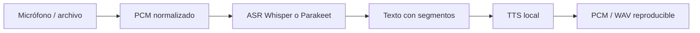

# Technical Summary — Class Speech Systems: ASR and TTS

## 1. Technical Sheet

- **Session topic:** Local audio contracts, transcription, synthesis and streaming relay.
- **Key concepts:** PCM; WAV; codec; sample rate; channels; ASR; VAD; timestamps; TTS; TTFT; TTFA; backpressure.
- **Tools / Frameworks:** Local ASR and TTS capabilities with audio capture and playback.
- **Position in the bootcamp:** Extends local-first systems from text to continuous media.

## 2. Synopsis

Audio begins as samples under a format contract, not text. ASR produces segments and TTS produces new samples. Each boundary needs declared format and timing so a sample-rate mismatch is not mistaken for model failure.

## 3. Subtopic Breakdown

### 1. Audio contract

specify sample rate, channels, depth and endianness.

### 2. ASR and TTS

segments and timestamps preserve traceability.

### 3. Streaming

queues, correlation and cancellation prevent stale playback.


### Extended Technical Discussion

El audio crudo del micrófono o de un archivo no es “texto” ni “voz sintetizada”. Es una secuencia de muestras PCM con propiedades físicas: frecuencia de muestreo, canales, profundidad de bits y endianness. ASR consume esas muestras y emite texto; TTS consume texto y emite muestras. Un relay conecta ambas etapas sin perder observabilidad.

Cada frontera tiene un contrato. Un backend que espera PCM mono a 16 kHz rechazará o degradará audio a 48 kHz sin conversión documentada. Un error de formato no debe etiquetarse como “silencio” ni persistirse como transcripción vacía.



Whisper es una referencia generalista robusta; Parakeet puede ser atractivo cuando el backend y el hardware favorecen throughput. La elección depende del hardware, no de una promesa genérica.

---

### Términos

#### Índice rápido

| Término | Definición breve |
|---|---|
| **Audio contract** | Declaración explícita de sampleRate, channels, sampleFormat, endianness y durationMs |
| **PCM / WAV** | Muestras crudas vs. contenedor que puede envolver PCM |
| **ASR** | Automatic Speech Recognition: audio → texto |
| **TTS** | Text-to-Speech: texto → audio |
| **Partial vs final transcript** | Hipótesis provisional vs. segmento estable para downstream |
| **segmentId** | Identificador monótono que correlaciona eventos de un segmento |
| **VAD** | Voice Activity Detection: detecta voz vs. silencio |
| **Voice relay** | Pipeline observable que encadena captura → ASR → TTS |
| **TTFT / TTFA** | Time to first text / time to first audio |

#### Audio contract

**Definición:** Contrato que declara las propiedades físicas del audio antes de cualquier inferencia.

**Uso:** Validar entrada y salida en cada frontera del relay. Sin contrato, un backend interpreta bytes incorrectamente.

**Sintaxis / API:**

| Campo | Tipo | Descripción |
|---|---|---|
| `sampleRate` | `number` | Muestras por segundo (p. ej. 16000, 22050, 48000) |
| `channels` | `number` | 1 = mono, 2 = estéreo |
| `sampleFormat` | `'s16le'` | 16-bit signed little-endian (convención del bootcamp) |
| `endianness` | implícito en `s16le` | Little-endian para PCM estándar |
| `durationMs` | `number` | Duración calculada desde bytes y formato |

**Ejemplo:**

```ts
type AudioFormat = {
  sampleRate: number
  channels: number
  sampleFormat: 's16le'
}
const format: AudioFormat = { sampleRate: 16_000, channels: 1, sampleFormat: 's16le' }
const pcm = new Uint8Array(format.sampleRate * 2) // 1 s, 16-bit mono
const durationMs = pcm.byteLength / (format.sampleRate * format.channels * 2) * 1000
console.log({ format, durationMs })
```

**Resultado:** Objeto `{ format, durationMs: 1000 }` antes de llamar a ASR o TTS.

**Nota:** Un WAV puede contener PCM, pero MP3 y Opus requieren decodificación previa. El contrato aplica a las muestras, no al contenedor.

#### PCM / WAV

**Definición:** PCM es una secuencia de muestras de amplitud; WAV es un contenedor de archivo que suele envolver PCM con un header RIFF.

---

## 4. Points of Confusion and Corner Cases

- WAV is a container while PCM is a sample representation.
- An empty transcript can be a format or VAD failure.
- Total latency does not replace first text and first audio.

## 5. Study Questions

1. Specify a mono PCM contract.
2. Why measure TTFT, TTFA and total time separately?
3. How can old partial text be prevented from reaching TTS?

## Source Material

- [Canonical lesson](../class-07-speech-systems/lesson.md)
- **Module:** Módulo 3
