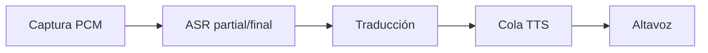

# Technical Summary — Class Translation and the Voice Relay

## 1. Technical Sheet

- **Session topic:** A local real-time interpreter across ASR, translation and TTS.
- **Key concepts:** partial and final hypotheses; segment ID; ordering; translation route; queueing; backpressure; cancellation; real-time factor.
- **Tools / Frameworks:** Local ASR and TTS plus generative or specialized translation.
- **Position in the bootcamp:** Composes several local models into a time-sensitive system.

## 2. Synopsis

A voice relay has multiple clocks. Recognition can revise partial text, translation can complete out of order, and synthesis can outpace playback. Stable segment identity, finality rules and bounded queues make those races visible and controllable.

## 3. Subtopic Breakdown

### 1. Segment state

captured, partial, final, translated, queued, played, canceled or failed.

### 2. Translation placement

language pair, latency, memory, quality and license influence routing.

### 3. Backpressure

coalesce, drop obsolete work or cancel instead of buffering without bounds.


### Extended Technical Discussion

La ruta local es: micrófono → PCM → ASR → texto → traductor → texto → TTS → altavoz. Ningún paso necesita un proveedor remoto si los modelos están provisionados con antelación. La privacidad se demuestra observando dependencias, sockets y artefactos en caché — no con una etiqueta.

Un ASR puede emitir hipótesis parciales que cambian al cerrar la frase. Una traducción parcial puede revertirse cuando llega el final. TTS necesita audio reproducible en orden. Si conectamos callbacks sin contratos, el sistema habla contenido obsoleto o se bloquea.



Tiempo real no significa que todas las etapas terminen a la vez. Cada etapa tiene su propio reloj.

---

### Términos

#### Índice rápido

| Término | Definición breve |
|---|---|
| **Four clocks** | Cuatro dominios temporales: captura, ASR, traducción, TTS |
| **segmentId** | ID monótono que correlaciona eventos de un segmento |
| **Backpressure** | Política cuando el productor supera al consumidor |
| **Partial translation** | Traducción de hipótesis aún no final — puede cambiar |
| **Relay state** | Estado observable del pipeline por segmento y global |
| **qvac-fabric-llm vs Bergamot** | LLM generativo vs. traductor neuronal especializado |
| **RTF** | Real-time factor: tiempo de síntesis / duración del audio |

#### Four clocks

**Definición:** Cuatro dominios temporales independientes en un intérprete: captura PCM, ASR, traducción y TTS/reproducción.

**Uso:** Diagnosticar cuellos de botella sin mezclar latencias. Cada reloj avanza a su ritmo.

**Sintaxis / API:**

| Reloj | Entrada | Salida | Bloquea captura |
|---|---|---|---|
| Captura | Micrófono | Frames PCM mono | — |
| ASR | PCM | `transcriptPartial` / `transcriptFinal` | No |
| Traducción | Texto final (o ventana estable) | `translation` | No |
| TTS | Texto traducido | PCM + reproducción | No |

**Ejemplo:**

```ts
// Cuatro timestamps independientes por segmento
const metrics = {
  captureToFinalMs: 820,
  translationMs: 140,
  ttsMs: 310,
  firstAudioMs: 45,
}
console.log(metrics)
```

**Resultado:** Tabla de latencias por etapa, no un solo número agregado.

**Nota:** TTS lento no debe bloquear la captura del siguiente segmento — eso es trabajo del relay y su política de colas.

#### Correlation with `segmentId`

Every detected speech segment needs a monotonic identifier that travels through transcription, translation,
synthesis, and playback. Without that correlation key, a slow response from an older segment can overwrite
the current transcript or be played after the conversation has already advanced. The identifier is therefore
part of the correctness contract, not merely a logging convenience.

The relay should compare identifiers before committing an event to visible state or to the playback queue.
Cancellation can invalidate all work below a chosen generation, while retries retain the original identifier
and add an attempt number. This distinction makes late, duplicated, and retried events observable and keeps
the user's audio timeline coherent even when individual stages finish out of order.

---

## 4. Points of Confusion and Corner Cases

- Real-time does not mean equal stage latency.
- Partial text is not automatically durable speech input.
- Remote fallback changes the privacy boundary.

## 5. Study Questions

1. Define transitions for partial and final results.
2. What do you optimize if ASR is fast but first audio is slow?
3. How does a bounded queue protect latency and memory?

## Source Material

- [Canonical lesson](../class-08-translation-voice-relay/lesson.md)
- **Module:** Módulo 3
