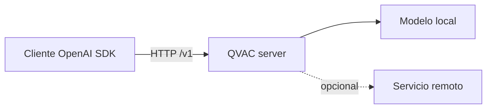

# Technical Summary — Class The OpenAI-Compatible Escape Hatch

## 1. Technical Sheet

- **Session topic:** Migration from remote inference to a local compatible HTTP contract.
- **Key concepts:** base URL; models; chat completions; SSE; compatibility; fallback; fail-closed; ADR.
- **Tools / Frameworks:** OpenAI-style client interfaces and QVAC compatible HTTP server.
- **Position in the bootcamp:** Replaces a cloud dependency without rewriting the whole client.

## 2. Synopsis

Compatibility provides a stable request and response shape while inference location changes. It does not guarantee identical model behavior or every remote feature. The configured base URL is a data, failure and privacy boundary that must be tested.

## 3. Subtopic Breakdown

### 1. Contract

model discovery and completions expose a familiar surface.

### 2. SSE

partial events need terminal handling and a commit policy.

### 3. Fallback

consent and sensitivity determine whether remote escalation is allowed.


### Extended Technical Discussion

> **Módulo 4 — Drop-in Sovereignty** · QVAC SDK v0.18.x / v0.18.1

### Pregunta esencial

> ¿Cómo cambiamos una aplicación de un proveedor remoto a inferencia local sin reescribir su cliente, y cómo demostramos qué dependencias permanecen?

### Resultados de aprendizaje

Al terminar puedes:

1. Explicar qué resuelve y qué no resuelve una API OpenAI-compatible.
2. Configurar `baseURL` como frontera de colocación, sin codificar secretos en el código.
3. Usar `/v1/models` y `/v1/chat/completions` para comprobar el contrato.
4. Consumir una respuesta normal y un stream SSE (`data: ...`, `[DONE]`).
5. Migrar un cliente conservando mensajes, parámetros y manejo de errores.
6. Detectar incompatibilidades de modelo, herramienta, visión y JSON estructurado.
7. Separar dependencia de red, dependencia del servidor y dependencia del modelo.
8. Medir TTFT, duración, tok/s y tamaño de respuesta en ambas rutas.
9. Diseñar un fallback explícito y fail-closed cuando los datos son privados.
10. Documentar la decisión en un ADR reproducible.

### La idea: una frontera estable

Un cliente moderno no debería saber si la inteligencia corre en la nube, en un proceso local o detrás de una máquina de la red privada. Debe conocer un contrato. QVAC expone un servidor HTTP compatible con OpenAI; por defecto:

```text
http://localhost:11434/v1/
```

La aplicación apunta al mismo recurso lógico (`chat.completions`), pero el proceso de inferencia cambia de lugar:



Compatibilidad significa que la forma de la petición y la respuesta es reconocible. No promete que todo modelo acepte todas las opciones ni que las salidas sean idénticas.

### El contrato mínimo

#### Descubrir modelos

```bash
curl -s http://localhost:11434/v1/models
```

Usa la respuesta para comprobar que el servidor está vivo y conocer los `id` aceptados. No asumas que el nombre de un modelo cloud existe localmente.

#### Completion normal

```bash
curl -s http://localhost:11434/v1/chat/completions \
  -H 'content-type: application/json' \
  -d '{"model":"local-model","messages":[{"role":"user","content":"Di hola en una frase."}],"temperature":0,"stream":false}'
```

El cliente debe leer `choices[0].message.content`, comprobar `error`, y registrar `usage` solo si el backend lo proporciona. `usage` ausente no significa necesariamente que la respuesta sea inválida.

#### Streaming SSE

Con `stream: true`, la respuesta es `text/event-stream`. Cada línea `data:` contiene JSON; el texto incremental suele estar en `choices[0].delta.content`. El stream termina con `data: [DONE]`.

```text
data: {"choices":[{"delta":{"content":"Hola"}}]}
data: {"choices":[{"delta":{"content":"."}}]}
data: [DONE]
```

SSE es transporte, no persistencia: conserva el buffer provisional y solo commitea el turno cuando la terminación es válida, igual que en la Clase 4.

---

## 4. Points of Confusion and Corner Cases

- API-compatible does not mean output-identical.
- Localhost alone does not prove every dependency is local.
- Silent fallback can be data exfiltration.

## 5. Study Questions

1. What stays unchanged after a base URL migration?
2. Which tests validate compatibility?
3. Design a fail-closed rule for private data.

## Source Material

- [Canonical lesson](../class-09-openai-compatible-escape-hatch/lesson.md)
- **Module:** Módulo 4
